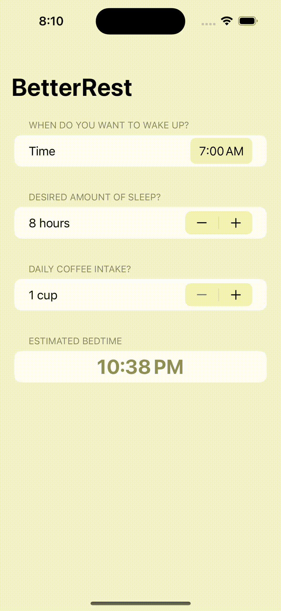

# BetterRest
An app for avid coffee drinkers to help them decide their bedtime based on three questions-
1. When do they want to wake up?
2. Roughly how many hours of sleep they want?
3. How many cups of coffee do they drink per day?

The app will predict the bedtime using the power of CoreML, a machine learning model.

P.S., The machine learning model is trained with dummy data and hence the app should not be used at a production level.

## Featuring
- CreateML
- CoreML
- Observation

## App Preview
*Please wait for the demo GIF to load*

  

## LICENSE

[MIT](LICENSE)
